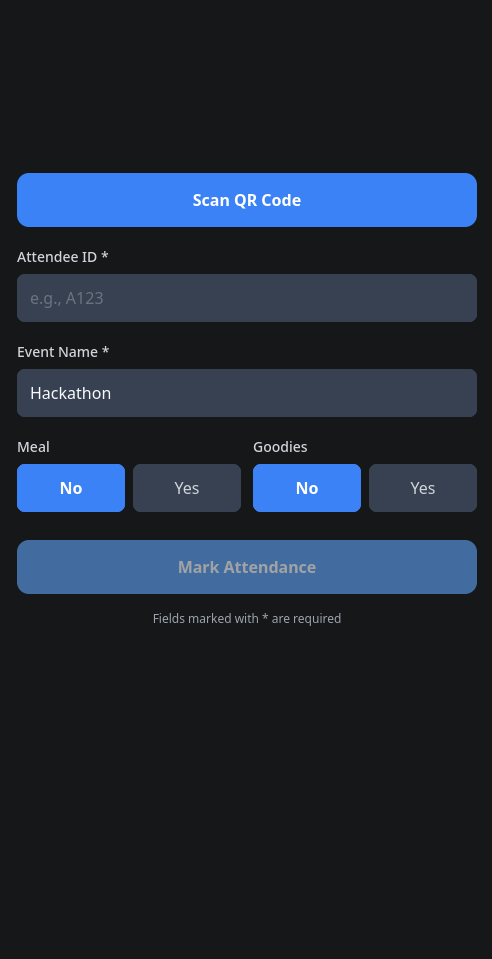

# TT Scan - IOIT TENET Attendance Scanner

A mobile attendance marking application built for **TENET 2025** (IOIT's annual tech event). Scan QR codes or manually enter attendee IDs to mark attendance, track meal and goodies selections.

## Features

- **QR Code Scanning** - Scan attendee QR codes using the device camera
- **Manual Entry** - Enter Attendee ID manually when QR scanning isn't available
- **Meal & Goodies Tracking** - Track meal and goodies preferences for each attendee
- **Event Support** - Configure event name for multi-event scenarios
- **Real-time Sync** - Attendance is synced to the server in real-time

## Tech Stack

- **Framework**: [Expo](https://expo.dev) (React Native)
- **Language**: TypeScript
- **Navigation**: expo-router
- **Camera**: expo-camera

## Getting Started

1. Install dependencies

   ```bash
   npm install
   ```

2. Start the development server

   ```bash
   npx expo start
   ```

3. Run on your preferred platform:
   - **Android**: `npx expo run:android`
   - **iOS**: `npx expo run:ios`
   - **Web**: `npx expo start --web`

## App Preview



## Usage

1. **Scan QR Code**: Tap the scan button to open the camera and scan an attendee's QR code
2. **Manual Entry**: Enter the Attendee ID (e.g., A123) in the input field
3. **Select Event**: Choose or enter the event name (default: Hackathon)
4. **Meal/Goodies**: Toggle meal and goodies preferences
5. **Submit**: Tap "Mark Attendance" to submit